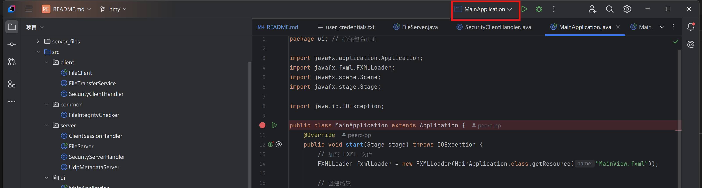

# network-file-transfer-tool
# 测试用户名：123 密码：123
GUI配置
1.安装sdk17(选择17是因为我的Scene Builder版本)
解压压缩包，复制里面lib文件夹的文件地址
然后再ide中配置

选择lib文件夹后一路点确定

2.配置参数
先找到源码中的MainApplication

点一下这个绿色的三角

当上面这里显示这个类名的时候，选择配置

按图配置

输入你自己的lib路径，点确定
--module-path "\your\path\to\javafx-sdk-21.0.2\lib" --add-modules javafx.controls,javafx.fxml

Scene Builder的配置（如果有修改ui的需求）
一路安装后记住路径
如图选自己的安装路径就好了

启动

进入界面就可以设计ui且自动生成前端代码，但是监听什么的还是要自己写，不会的上网查
安装包都发群里